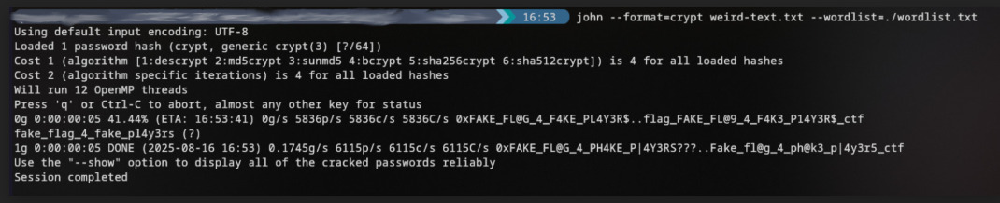

## The Ripper

Author: pseudonymous

Category: Hash Cracking

Difficulty: Medium

## Description

The guardian of this floor steps from the shadows. Known only as Jack the Ripper, he watches you carefully. He proclaims himself merciful and hands you a word list to help.
He asks you to find the passcode hidden in this hash `$2a$04$RNoyoWAcW0StwSri4YN1Eeb2j1gBNKutDOMxsLzfyfSvB/ghMHToa`. The word list is your only aid. Only by combining the two correctly can you uncover the key and move on to the next floor. Flag format: `citadel{password}`

## Writeup

- hash format can be found out by using an [online tool](https://hashes.com/en/tools/hash_identifier).
- hash format -> bcrypt, password is `fake_flag_4_fake_pl4y3rs`

### Flag: citadel{fake_flag_4_fake_pl4y3rs}
