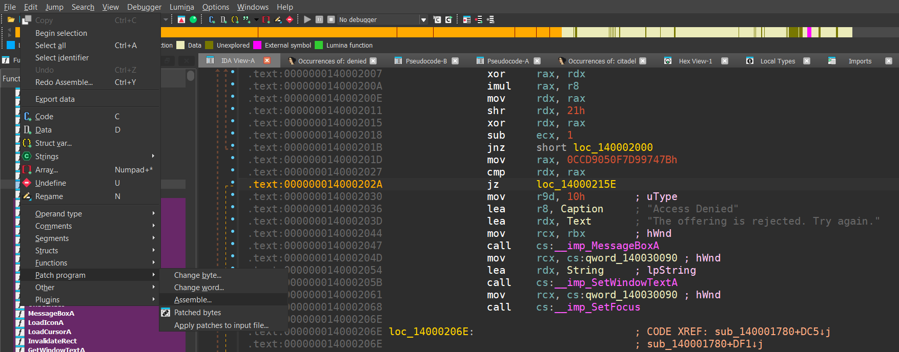
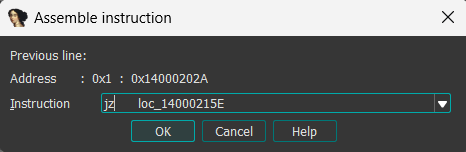
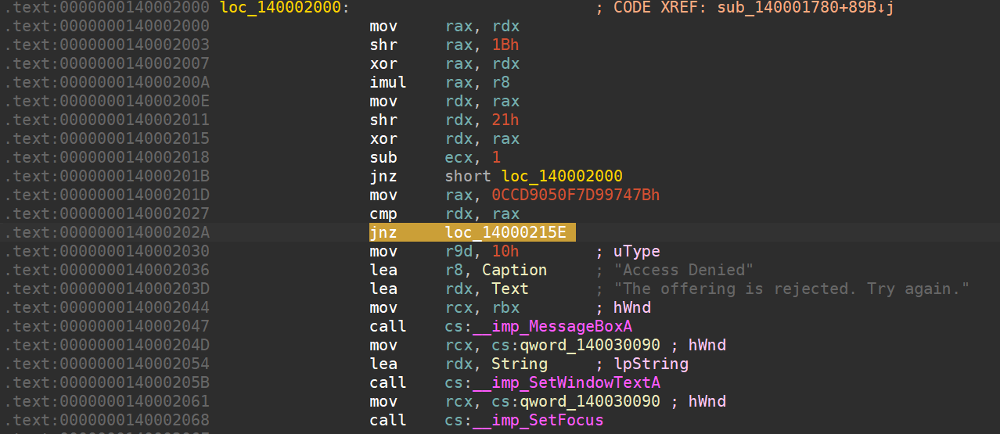
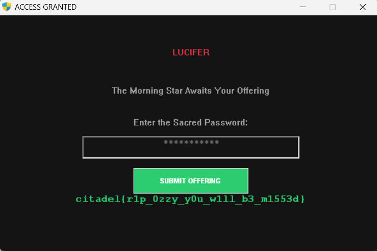

## Mr.Crowley

**Author**: shady

**Category**: Reverse Engineering

**Difficulty**: Hard

## Description

*Mr. Crowley, what went wrong in your head?*     
*The echo of chains marks the path you must tread.*    
*An oath turned to ash, by the living and dead.*    
*The curse still resounds in the word that was said.*    

*But in the shadows, a secret remains;*    
*Change the mark, and shatter these chains.*    
*A single leap where denial once stood,*      
*The gateway awakens, as only it could.*


## Writeup


running file on the PE will show you -

```python
└─$ file lucifer.exe
lucifer.exe: PE32+ executable for MS Windows 5.02 (GUI), x86-64 (stripped to external PDB), 10 sections
```

* let's start simple, running strings and grepping for the flag is a common practice while reverse engineering a simple challenge. upon doing that, we see

```python
└─$ strings lucifer.exe | grep -i citadel
citadel{
```

* now, upon searching for the same string after opening up a decompiler like IDA or Ghidra(i will be using IDA in this writeup), we see the function `sub_140001780` (in IDA). upon going thru this function, we can see that the part we're interested in is 

```python
if ( v17 == 0xCCD9050F7D99747BuLL )
{
    // access granted branch
}
else
{
    // "Access Denied" message
}
```

`v17` is a hash derived from the user input.  
if it matches `0xCCD9050F7D99747B`, the program grants access.  
otherwise it shows the _"The offering is rejected. Try again."_ box.


* for complete understanding, let's switch to the _disassembly_ view. (right click and click on _Synchronize_ with IDA view)
* while reading thru the "_Access Denied_" section, one can spot a peculiar jump statement. let me show you the entire code snippet.

```python
.text:0000000140002000 loc_140002000:                          ; CODE XREF: sub_140001780+89B↓j
.text:0000000140002000                 mov     rax, rdx
.text:0000000140002003                 shr     rax, 1Bh
.text:0000000140002007                 xor     rax, rdx
.text:000000014000200A                 imul    rax, r8
.text:000000014000200E                 mov     rdx, rax
.text:0000000140002011                 shr     rdx, 21h
.text:0000000140002015                 xor     rdx, rax
.text:0000000140002018                 sub     ecx, 1
.text:000000014000201B                 jnz     short loc_140002000
.text:000000014000201D                 mov     rax, 0CCD9050F7D99747Bh
.text:0000000140002027                 cmp     rdx, rax
.text:000000014000202A                 jz      loc_14000215E
.text:0000000140002030                 mov     r9d, 10h        ; uType
.text:0000000140002036                 lea     r8, Caption     ; "Access Denied"
.text:000000014000203D                 lea     rdx, Text       ; "The offering is rejected. Try again."
.text:0000000140002044                 mov     rcx, rbx        ; hWnd
.text:0000000140002047                 call    cs:__imp_MessageBoxA
.text:000000014000204D                 mov     rcx, cs:qword_140030090 ; hWnd
.text:0000000140002054                 lea     rdx, String     ; lpString
.text:000000014000205B                 call    cs:__imp_SetWindowTextA
.text:0000000140002061                 mov     rcx, cs:qword_140030090 ; hWnd
.text:0000000140002068                 call    cs:__imp_SetFocus
```


* in our case, our conditional jump is at address `0x14000202A`, where after some comparison, if true (or output of `cmp` is `0`), we jump to `loc_14000215E`. but as the author of this challenge, i know that this comparison will only be true when the correct password is inputted by the user, and the password is next to impossible to reverse engineer. so what do we do now?

**_what if i told you there was a way to bypass the password check entirely?_**

* to bypass the password entirely, you need to _patch_ the conditional jump after the comparison:

    - Change `jne fail_path` → `jmp success_path`.
    
    - often you’re flipping a single conditional opcode (e.g. `74` (JE) → `75` (JNE), or just NOPing).

in this challenge, since we know that the jump at `0x14000202A` can be patched, all we have to do is change the `JZ`(Jump if Zero) to `JMP`(jump). the simplest way to do this (in IDA) is -

* go to `Edit>Patch Program>Assemble...` 

   
* and then you'll be greeted with this pop-up 



* literally all you have to do is change `jz` to `jnz`. (easiest)
* click on `OK` 
* go to `Edit>Patch Program>Apply patches to input file...`  and click on `OK` (x2).

your comparison should now look like this- 



that's all it took. one byte and the entire password check system crumbles. how awesome is that?

all that's left to do is to run the `.exe` again, and this time, give it ANY input and submit and you shall get the flag.




    

**Flag:`citadel{r1p_0zzy_y0u_w1ll_b3_m1553d}`**

