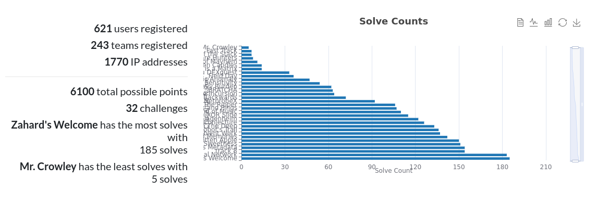

# CitadelCTF-2025

Citadel CTF 2025 was a 48 hour jeopardy-style Capture the Flag (CTF) event held exclusively for Manipal Academy of Higher Education (MAHE) students. It was conducted in online mode on 4th to 6th October 2025 as part of Cryptober 2025.

This repository contains official writeups for challenges from Citadel CTF 2025.

## Statistics

